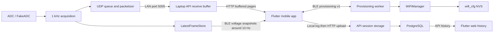

# Combine the MCU firmware and application

**For the ordered development checklist, open [NEXT_STEPS](../NEXT_STEPS.md)**
or the [visual PDF guide](Capstone_Next_Steps_Guide.pdf).


Both codebases now live in one repository on the integration branch. Keep their
builds separate and join them through the existing byte protocols. Do not move
ESP-IDF C++ into Flutter, or put API/database code on the ESP32.
The current product specification is [Will and Kenny Startup.pdf](../app/docs/Will%20and%20Kenny%20Startup.pdf).

## Combined structure

| Location | Runs on | Owns |
| --- | --- | --- |
| `main/`, `components/`, root CMake | ESP32 / ESP32-S3 | Acquisition, ADC interface, packetization, BLE, Wi-Fi, NVS, UDP |
| `app/apps/monitor/` | Android; web preview/history | Provisioning client, device display, local capture log, collector uploads, history UI |
| `app/apps/api/` | Laptop for the bench | UDP receive buffer, validation, accounts, sessions, HTTP API |
| `app/database/` | Laptop PostgreSQL | Persistent sessions and per-channel measurements |
| `contracts/protocol-v1.json` | Tests on the developer computer | Shared known-good bytes and decoded values |
| `tools/check_integration.py` | Developer computer | Cross-codebase contract checks |

Android is the current direct BLE/USB entry point. The iOS host project exists,
but `screens.dart` only exposes Device connections on Android; its native
connection page also depends on Android connectivity/USB methods. Enabling iOS
BLE requires a separate platform adapter, Bluetooth usage descriptions, and Mac
validation. A browser can preview the collector and receive data through the API;
it cannot use this native BLE/USB implementation.

## Two independent paths



BLE configures the ESP32's router credentials. Wi-Fi transports measurement
packets to the laptop. The mobile collector still decides what enters a session,
writes its local log, and uploads to the API. Receiving UDP must not write
measurements directly to SQL. Provisioning must never use or drain the acquisition
queue. Losing a router or BLE link must not change the sampling timer.

Do not add API login, cloud setup, or UDP destination discovery to provisioning
v1: the PDF explicitly excludes them. The existing app login protects stored data;
it is separate from BLE pairing and from Wi-Fi credentials.

## Interfaces already compatible

| Interface | Firmware producer | App consumer | Contract |
| --- | --- | --- | --- |
| UDP measurement | `components/protocol/packetizer.cpp` | `app/apps/api/src/device-udp.js` | 88 bytes; BM, v1, 16 signed microvolt channels; network byte order; CRC32 |
| UDP batch | `components/protocol/include/batch_packet.hpp` | same decoder | 10-byte BB header plus 1–10 complete frames; at most 890 bytes |
| BLE voltage | `components/ble/ble_manager.cpp` | `app/apps/monitor/lib/device_packets.dart` | 80 bytes; sequence, monotonic timestamp, channels, status; MTU at least 83 |
| Wi-Fi status | `components/ble/wifi_provisioning.cpp` | `wifi_protocol.dart` / `wifi_settings.dart` | 8 bytes; version, state, flags, error, IPv4 |
| Wi-Fi scan | same provisioning worker | same Flutter files | Control ACK, 13-byte Data chunks, SCAN_COMPLETE; works at ATT MTU 23 |

Shared fixtures pin both signed values and a 64-bit timestamp. The C++ golden
packet deliberately includes int32 extrema: decoding those bytes is valid, but
voltages outside ±5 V must not be uploaded. Separate bench fixtures use values
within ±5 V for API/session acceptance. MCU timestamps are time since boot,
not UTC; collector timestamps anchor device intervals to estimated host UTC at
microsecond precision, retaining that identity on retry.

## Work required before full Wi-Fi setup works

| Gap found in this branch | Concrete implementation | Acceptance |
| --- | --- | --- |
| Firmware only accepts GET_STATUS and START_SCAN; Data writes are rejected | Extend `provisioning_protocol.hpp` and `wifi_provisioning.cpp` with BEGIN, credential Data reassembly, COMMIT, CLEAR, CANCEL, and the PDF errors | Send the app's exact fragments at MTU 23; match ACK/error transaction IDs |
| No sensitive transaction state yet | Stage at most 97 bytes in bounded RAM; remember transaction and object IDs, check offsets/constant length/overlap; expire after about 60 s; clear on cancel/disconnect/expiry; never log buffers | Malformed, incomplete, conflicting, and interrupted transfers leave NVS untouched |
| `saveCredentials()` persists only; applying requires reboot | Add a WiFiManager apply/connect operation called serially from the communications worker after valid save; preserve the manager as the only Wi-Fi state owner | COMMIT goes CONNECTING → CONNECTED or actionable failure without reboot |
| `clearCredentials()` deinitializes the station and leaves it stopped | After clear, restore an unprovisioned station capable of scans, without a connection attempt or development seeding | Forget → UNPROVISIONED → scan → new credentials in one boot |
| BLE init has no explicit secure-pairing configuration; app rejects an unencrypted status | Configure LE Secure Connections and the pairing UX; independently enforce encrypted links on BEGIN/Data/COMMIT/CLEAR; publish encryption changes | Unsecured writes rejected by firmware, not just the app; real phone can pair and provision |
| Status notifications occur only for explicit reads/scan events | Publish WiFiManager state changes, IP and security updates through the NimBLE host event queue; do not send BLE from Wi-Fi callbacks | Wrong password, router loss/recovery, and successful commit update the app automatically |
| Retry can replace CONNECTION_FAILED immediately with CONNECTING | Preserve an observable failure/error reason and connection timeout while retaining reconnect behavior | App sees actionable failure and can replace credentials; acquisition continues |
| Old app device instructions assume compile-time Wi-Fi credentials | Use this guide for the integration sequence; temporary development seed is explicitly controlled and disabled for final firmware | Fresh device needs no SSID/password recompilation |

Do the firmware work on this integration branch in the order: secure link and
bounded transaction parser; worker-owned credential save/apply/clear; automatic
status/error notifications; then physical acceptance. Keep ADC, acquisition,
packet serialization, and existing measurement UUIDs unchanged. The current app
already implements the client commands; it must not report end-to-end setup as
working against status/scan-only firmware.

A transaction's control and Data callbacks should validate/copy bounded data and
queue work. Flash writes, scans, and station lifecycle operations belong to the
same communications worker. Do not call WiFiManager mutations concurrently with
a scan, or while a worker owns a staged credential buffer. Carry a BLE connection
session generation into queued results so a reconnect cannot receive an old
client's response. Clear sensitive worker copies even if completion arrives after
disconnect. SSID/password validation must agree with the PDF (32/63-byte limits,
open networks allowed, Enterprise unsupported); NVS's existing optional 64-digit
PSK support does not extend the BLE v1 object limit.

The optional `app/firmware/usb_measurement_console.hpp` extension can be wired
into `main/main.cpp` later to emit snapshot BMHEX lines. It is currently an
extension, not compiled root firmware. Keep it low rate and read LatestFrameStore,
never consume the UDP queue. This is independent of the required BLE provisioning.

## Bring the current combined repository up on a bench

1. In `app/executables/`, run `00_First_Time_Setup.cmd` once. It creates local
   dependencies, example environment settings, database and web build under
   `app/`. Run optional Android setup separately when needed.
2. Start the app with root `Start_Project.cmd`. This delegates to the existing
   app launcher; it does not build or flash firmware. Use root
   `Setup_App.cmd` for first-time setup. Root firmware remains built with ESP-IDF.
3. Put the laptop and phone on a reachable private network. Set the firmware's
   `components/udp/include/udp_config.hpp` destination to the laptop LAN IPv4
   address; its current committed address is a previous bench address. Port 5005
   matches the API. Allow private-network UDP 5005 and TCP 3001 as appropriate.
   UDP destination configuration remains separate from BLE Wi-Fi provisioning.
4. In an ESP-IDF 5.5.5 terminal at repository root, select `esp32` for the current
   test board or `esp32s3` for the planned board, build, and flash its actual port.
   Current firmware needs previously stored credentials or an explicitly enabled
   temporary development seed; complete the missing credential worker before
   treating a fresh device's app setup as functional.
5. Start the normal app/API receiver, and stop `tools/udp_receiver.py` first if it
   is running: both would otherwise contend for UDP 5005. Use
   `http://10.0.2.2:3001` from an Android emulator and
   `http://LAPTOP_LAN_IP:3001` from a physical phone. The website is port 5173.
6. Select the discovered UDP sender, pair the app's source record, create a
   session and Start capture. This IP-based app pairing is not encrypted BLE
   pairing or cryptographic device identity. Confirm stored values in web history.
7. Separately connect to BatteryMonitor over BLE. Status and scans work with the
   current firmware; credential writes remain blocked until the work above is done.

## Repeatable verification

Measurement throughput is now tested separately through real UDP, the Dart
collector's durable journal, HTTP and PostgreSQL. See
[1kSPS minimum / 2kSPS target acceptance](../app/docs/1ksps-capture.md) for sustained-load
results and the commands. This host evidence does not replace the physical
phone/ESP32 timing gate below.

After app dependencies are installed and Flutter package resolution completes:

```powershell
python tools/check_integration.py
# Or specify an existing SDK explicitly:
python tools/check_integration.py --flutter C:\path\to\flutter\bin\flutter.bat
```

The checker reads the C++ self-test's fixed golden bytes, checks shared fixtures
and NimBLE UUIDs, runs the firmware's Python receiver tests, exercises the actual
Node decoder/API through collector-style upload and history reads, and runs the
Flutter BLE/USB/provisioning fixture tests. A lost upload acknowledgment is retried
without extra SQL-style rows. The API contract test uses temporary MemoryStore;
run `app/dev.cmd test` separately for real PostgreSQL and full app tests.

The default checker requires all three language runtimes. `--skip-flutter`
reports a partial check; it must not be reported as complete verification.
Fixture updates are deliberate via `python tools/generate_protocol_fixtures.py --write`.
Review wire changes before regenerating; do not regenerate just to silence failures.
These checks run host decoders against the C++ golden reference; they do not
compile ESP-IDF or prove radio behavior. No firmware compiler is available on
this workstation. Run `idf.py build` on the firmware machine and every acceptance
case in section 27 of the PDF on the actual board, including persistence,
wrong-password recovery, encrypted pairing, approximately 1,000 frames/s, and no
provisioning-caused acquisition queue overflow.

Keep this branch separate from main until those integration gates are reviewed.

## Verification recorded on 2026-09-29

The unified checker completed successfully on Windows: fixture consistency,
9 Python tests (including shared firmware/client UUID checks), 3 Node integration
tests, and 3 Flutter shared-contract tests. No checks were skipped. The tests
validate host wire compatibility and API upload ownership; they do not replace
an ESP-IDF firmware build or any physical acceptance case. Firmware production
source was preserved while this architecture and integration plan was prepared.
